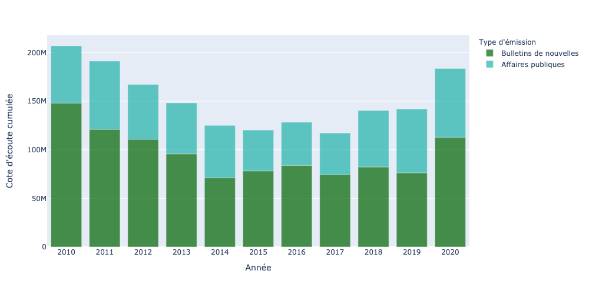

# noovo

Triple analyse de données pour un article dans [*La Conversation*](). J'y examine le contexte dans lequel est apparu [**Noovo.info**](), service d'information de la chaîne télé généraliste appartenant à Bell Media, le 29 mars 2021.

### Étape 1 - Données d'écoute télé

[J'avais déjà analysé l'évolution de l'écoute de l'information dans la télévision québécoise au début de la dernière décennie](http://jhroy.ca/2014/09/cotes-ecoute-info-pire/). Il s'agissait de faire une mise à jour en allant d'abord chercher des données chez Numeris, l'organisme qui calcule les auditoires radio et télé depuis plus de trois quarts de siècle. Parmi les données librement accessibles, il y a le [palmarès des 30 émissions les plus écoutées chaque semaine au Québec francophone](https://fr.numeris.ca/media-and-events/tv-weekly-top-30). Chaque semaine tient dans un document PDF.

Il fallait donc aller chercher tous les fichiers que je n'avais pas déjà moissonnés en 2014. Comme le site de Numeris est conçu pour compliquer la vie des moissonneurs de données, j'ai commencé par copier-coller le HTML qui contient les URL vers tous les documents PDF contenant les palmarès hebdomadaires d'écoute&nbsp;: [**numeris.html**](numeris.html)

Ce court script ([**pfds.py**](pfds.py)) permettait ensuite de recueillir les URL de tous les documents et de les consigner dans un fichier CSV ([**numeris.csv**](numeris.csv)).

J'utilisais ensuite un autre script ([**pdf-tabula.py**](pdf-tabula.py)) pour télécharger les fichiers PDF du site de Numeris. Le script y effectuait au passage une reconnaissance optique de caractères à l'aide de la bibliothèque [tabula-py](https://pypi.org/project/tabula-py/). Tabula est également [un logiciel](https://tabula.technology/), fort utile, qui permet de transformer en CSV des tableaux se trouvant dans des documents PDF. Et c'est ainsi que chaque ligne de chaque palmarès a été transformée en une ligne dans un grand fichier CSV... que j'ai cependant dû nettoyer et compléter, car les données de Numéris peuvent être mal structurées (certains palmarès en français ne sont accessibles qu'en passant par la version anglaise du site). Par ailleurs, une semaine est manquante (celle du 20 au 26 février 2012)... C'est cependant le seul trou dans les données pour la décennie.

Le fichier complet, propre et dans lequel j'ai identifié les émissions d'information et les bulletins de nouvelles est ici&nbsp;: [**numeris-2010-2020.csv**](numeris-2010-2020.csv). C'est ce fichier qui a servi à réaliser ce graphique&nbsp;:

### Étape 2 - Données de Facebook et d'Instagram

