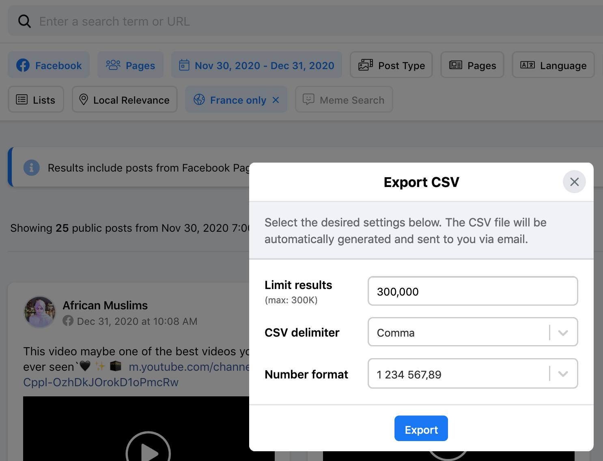

# noovo

Triple analyse de données pour un article dans [*La Conversation*](). J'y examine le contexte dans lequel est apparu [**Noovo.info**](), service d'information de la chaîne télé généraliste appartenant à Bell Media, le 29 mars 2021.

### Étape 1 - Données d'écoute télé

[J'avais déjà analysé l'évolution de l'écoute de l'information dans la télévision québécoise au début de la dernière décennie](http://jhroy.ca/2014/09/cotes-ecoute-info-pire/). Il s'agissait de faire une mise à jour en allant d'abord chercher des données chez Numeris, l'organisme qui calcule les auditoires radio et télé depuis plus de trois quarts de siècle. Parmi les données librement accessibles, il y a le [palmarès des 30 émissions les plus écoutées chaque semaine au Québec francophone](https://fr.numeris.ca/media-and-events/tv-weekly-top-30). Chaque semaine tient dans un document PDF.

Il fallait donc aller chercher tous les fichiers que je n'avais pas déjà moissonnés en 2014. Comme le site de Numeris est conçu pour compliquer la vie des moissonneurs de données, j'ai commencé par copier-coller le HTML qui contient les URL vers tous les documents PDF contenant les palmarès hebdomadaires d'écoute&nbsp;: [**numeris.html**](numeris.html)

Ce court script ([**pfds.py**](pfds.py)) a ensuite permis de recueillir les URL de tous les documents et de les consigner dans un fichier CSV ([**numeris.csv**](numeris.csv)).

J'ai ensuite utilisé un autre script ([**pdf-tabula.py**](pdf-tabula.py)) pour télécharger les fichiers PDF du site de Numeris. Le script y effectue au passage une reconnaissance optique de caractères à l'aide de la bibliothèque [tabula-py](https://pypi.org/project/tabula-py/). Tabula est également [un logiciel](https://tabula.technology/), fort utile, qui permet de transformer en CSV des tableaux se trouvant dans des documents PDF. Et c'est ainsi que chaque ligne de chaque palmarès a été transformée en une ligne dans un grand fichier CSV... que j'ai cependant dû nettoyer et compléter, car les données de Numéris peuvent être mal classées (parfois, c'est la version anglaise du palmarès, et donc pour l'écoute nationale pan-canadienne, qui est accessible sur la version française du site, ou vice-versa). Par ailleurs, une semaine est introuvable (celle du 20 au 26 février 2012)... C'est cependant le seul trou dans les données pour la décennie.

Le fichier complet, propre et dans lequel j'ai identifié les émissions d'information et les bulletins de nouvelles est ici&nbsp;: [**numeris-2010-2020.csv**](numeris-2010-2020.csv). C'est ce fichier qui a servi à réaliser ce graphique&nbsp;:


### Étape 2 - Données de Facebook et d'Instagram

Pour explorer l'univers de la vidéo d'information pour plateformes mobiles, je suis allé chercher des données dans [CrowdTangle](https://www.crowdtangle.com/).

#### Étape 2.1 - Facebook

Pour Facebook, j'ai procédé en téléchargeant les 300&nbsp;000 publications ayant obtenu le plus grand nombre d'interactions à chaque mois de l'année 2020, obtenant ainsi 3,6 millions de publications (*posts*) au final pour l'année. J'ai fait l'exercice avec les pages majoritairement administrées au Canada, puis avec celles qui sont majoritairement administrées en France. Par exemple, pour recueilir les données françaises pour le mois de décembre 2020, l'expression entrée dans la section *Search* de CrowdTangle, est celle-ci:

```https://apps.crowdtangle.com/search/results?includedCountries=FR&customStartDate=2020-12-01T00:00:00&customEndDate=2021-01-01T00:00:00&customChartStartDate=2020-12-01T00:00:00&customChartEndDate=2021-01-01T00:00:00&platform=facebook&postTypes=&producerTypes=3&q=&sortBy=score&sortOrder=desc&timeframe=custom```



Pour un autre projet de recherche, je ne m'intéresse qu'aux contenus publiés en français. J'ai donc passé mes 7,2 millions de publications à travers un premier filtre, celui de la langue. Cela m'a donné **621&nbsp;509** publications en français au Canada et **2&nbsp;779&nbsp;406** en France.

Le deuxième filtre a été celui des contenus vidéo. Dans une page Facebook, chaque publication peut être de 10 types différents. Voici la répartition de mon échantillon en fonction du pays. Les types en caractères gras sont ceux que j'ai conservés parce qu'ils s'agit de contenu vidéo.

| Type        | France (nb de *posts*)        | Canada  (nb de *posts*)  |
| ------------- |-------------:| -----:|
| Photo | 1&nbsp;491&nbsp;653 | 258&nbsp;202 |
| Link | 733&nbsp;926 | 245&nbsp;038 |
| **Native Video** | 427&nbsp;665 | 67&nbsp;241 |
| **Live Video Complete** | 55&nbsp;450 | 15&nbsp;395 |
| Status | 50&nbsp;414 | 31&nbsp;019 |
| **YouTube** | 17&nbsp;557 | 4&nbsp;065 |
| **Video** | 2&nbsp;319 | 375 |
| **Live Video Scheduled** | 420 | 174 |
| Album | 1 | 0 |
| **Live Video** | 1 | 0 |
| *Total de publications vidéos* | *503&nbsp;412* | *87&nbsp;250*|

Il fallait enfin faire passer le demi-million de publications qui restent par un troisième filtre qui ne conservait que celles de pages appartenant à des médias. J'ai utilisé les mêmes critères que ceux dont je me suis servi à l'automne 2020 et les ai appliqués également à la France.

Dans le texte publié dans *La Conversation*, je mentionne aussi le nombre de vues que c'est vidéos ont obtenues. Je n'ai considéré que [ce que CrowdTangle définit comme *Post views*](https://help.crowdtangle.com/en/articles/3213537-crowdtangle-codebook), c'est-à-dire des vues qui ont été enregistrées uniquement sur la page Facebook en question. Je me suis rendu compte que les deux autres paramètres proposés par CT (*Total Views* et *Total Views for all Crossposts*) peuvent inclure des vues pour des vidéos virales produites par d'autres pages et republiées par les médias. Il serait trompeur d'attribuer aux médias qui ne font que republier ces vidéos des vues qui ont été enregistrées un peu partout dans Facebook.

